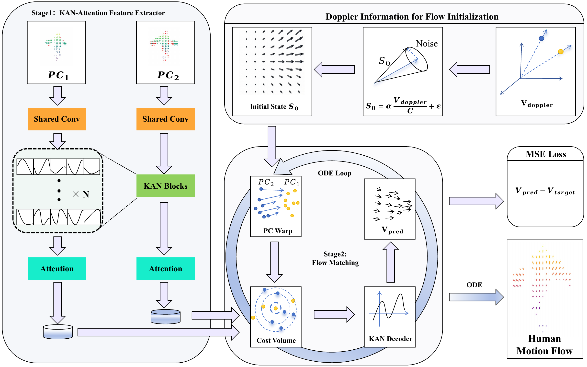

# DiFF: Doppler-informed Flow Matching for Human Motion Flow

Perceiving human motion via privacy-preserving **4D millimeter-wave (mmWave) radar** is critical for next-generation human-robot interaction (HRI), where point cloud scene flow serves as a foundational motion representation. Yet the extreme sparsity and noise of 4D radar point clouds make non-rigid **motion flow** estimation severely ill-posed--a challenge that existing rigid-centric methods and prior works fail to adequately address, largely because they neglect the rich Doppler velocity cues inherent in 4D radar. We propose **DiFF**, a generative framework that marries **Doppler-informed motion priors** with a **Kolmogorov-Arnold Network (KAN)-based conditional flow matching model**. At its core, a KAN-attention mechanism enables expressive feature extraction, while a prior-guided generative process harnesses Doppler cues to regularize the ill-posed solution space.



## Contents

```text
config.yaml                 # MMBody configuration template
config_milliflow.yaml       # MilliFlow configuration template
train.py                    # MMBody/general training entry point
train_milliflow.py          # MilliFlow training entry point
evaluate.py                 # Checkpoint evaluation entry point
evaluate_milliflow.py       # MilliFlow 6/4-KNN evaluation entry point
datasets.py                 # Dataset loaders
flow_matching.py            # Flow matching and ODE integration
flow_models.py              # Velocity-field networks
pointkan_encoder.py         # PointKAN encoder
ckpt/                       # Optional reference checkpoints
models/                     # PointKAN/KAN modules
kat_rational/               # Rational activation implementation
pointnet2_ops_lib/          # PointNet++ extension source
rational_kat_cu/            # Optional rational CUDA extension
```

## Installation

Use a Conda environment with a CUDA-compatible PyTorch installation:

```bash
pip install -r requirements.txt
pip install ./pointnet2_ops_lib
```

The optional rational CUDA extension can be installed with:

```bash
pip install ./rational_kat_cu
```

## Dataset layout

The dataset is not included. Set the dataset path in the selected YAML
configuration file.

MMBody data should follow this layout:

```text
data/mmbody/
├── train/sequence_name/*.json
└── test/sequence_name/*.json
```

MilliFlow data should follow this layout:

```text
data/milliflow/data/
├── train/sequence_name/*.json
├── val/sequence_name/*.json
└── test/sequence_name/*.json
```

Each sample contains `pc1`, `pc2`, and `gt_flow`. MMBody samples store the
measured Doppler value in the fifth column of `pc1`.

## Training

Train on MMBody:

```bash
python train.py --config config.yaml
```

Train on MilliFlow:

```bash
python train_milliflow.py --config config_milliflow.yaml
```


## Evaluation

Evaluate an MMBody checkpoint with:

```bash
python evaluate.py --config config.yaml --ckpt /path/to/model.pth
```

Evaluate a MilliFlow 6/4-KNN checkpoint with:

```bash
python evaluate_milliflow.py --config config_milliflow.yaml --ckpt /path/to/model.pth
```

Reference checkpoints, when included, are stored under `ckpt/`.

## License

See [LICENSE](LICENSE).
